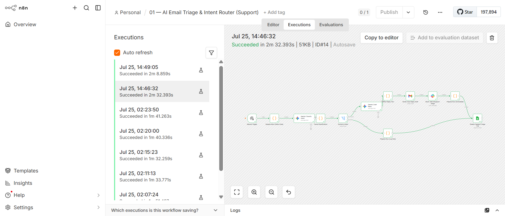
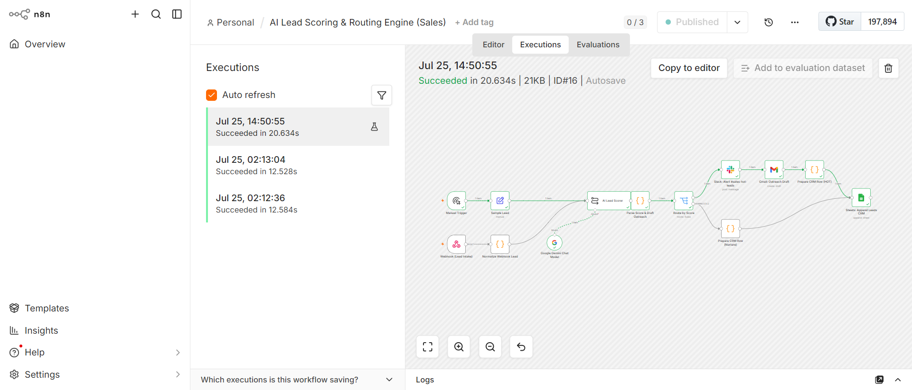
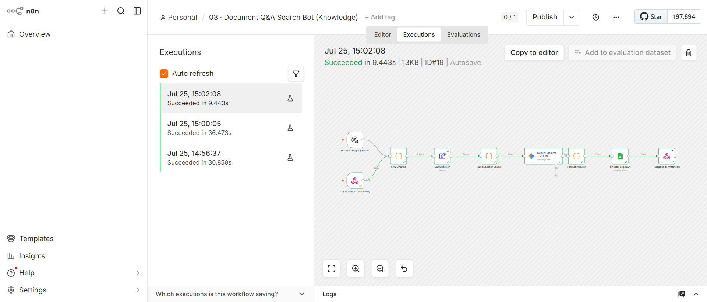
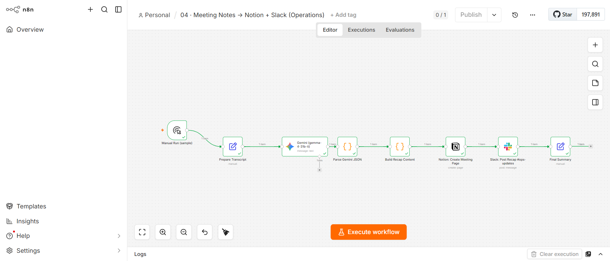

# n8n Workflow Showcase

> Production-ready n8n automations built by **Sasidhar Sunkesula** — Full-Stack Developer & AI Automation Engineer.

These workflows are **live, tested, and connected to real accounts** (Gmail, Google Sheets, Slack, Notion) with **Google Gemini (Gemma 4 31B)** powering the AI. Every workflow below has been executed end-to-end with real API calls — not mock data.

## 🤖 What I Build
AI-powered n8n automations for:
- **Support** — email triage, intent routing, auto-drafts
- **Sales** — lead scoring, routing, outreach
- **Knowledge** — document Q&A, retrieval-augmented answers
- **Operations** — meeting notes → Notion + Slack

## 📋 The Workflows

### 1. AI Email Triage & Intent Router (Support)
Classifies inbound emails (Question / Request / Complaint / FYI / Spam), drafts tone-matched replies with Gemini, posts to Slack `#support-triage`, and logs to Google Sheets.

→ [Details](workflows/01_email_triage_README.md) · [Import JSON](workflows/01_email_triage.json)

### 2. AI Lead Scoring & Routing Engine (Sales)
Scores inbound leads HOT / WARM / COLD with reasoning via Gemini, drafts personalized outreach, and routes HOT leads to Slack `#sales-hot-leads` + Gmail draft, others to a CRM sheet.

→ [Details](workflows/02_lead_scoring_README.md) · [Import JSON](workflows/02_lead_scoring.json)

### 3. Document Q&A Search Bot (Knowledge)
Retrieval-augmented Q&A over your FAQ/docs — keyword retrieval feeds grounded answers from Gemini, logged to Sheets.

→ [Details](workflows/03_rag_chatbot_README.md) · [Import JSON](workflows/03_doc_qa.json)

### 4. Meeting Notes → Notion + Slack (Operations)
Extracts action items, decisions, and summary from a meeting transcript via Gemini, creates a Notion page, and posts a Slack recap.

→ [Details](workflows/04_meeting_notes_README.md) · [Import JSON](workflows/04_meeting_notes.json)

## 🛠️ Tech Stack
- **n8n** (self-hosted, v2.31.6)
- **Google Gemini** — `gemma-4-31b-it` via Google AI Studio
- **Gmail / Google Sheets** (OAuth2)
- **Slack** (OAuth2)
- **Notion** (API)

## 🚀 How to Use
1. Import any `*.json` into your n8n instance (Workflows → Import from File).
2. Connect your own credentials (Gmail, Sheets, Slack, Notion, Gemini) — the workflows reference real node types.
3. Execute — or activate and trigger via webhook / schedule.

## 💼 Hire Me
I build custom n8n automations and AI agents (LangChain, LangGraph, mastra.ai) for businesses.
- LinkedIn: [linkedin.com/in/sasidhar-sunkesula](https://linkedin.com/in/sasidhar-sunkesula)
- GitHub: [github.com/Sasidhar-Sunkesula](https://github.com/Sasidhar-Sunkesula)
- Email: www.sasidharsunkesula579@gmail.com

---
*All workflows demonstrated with real connected accounts and verified executions.*
