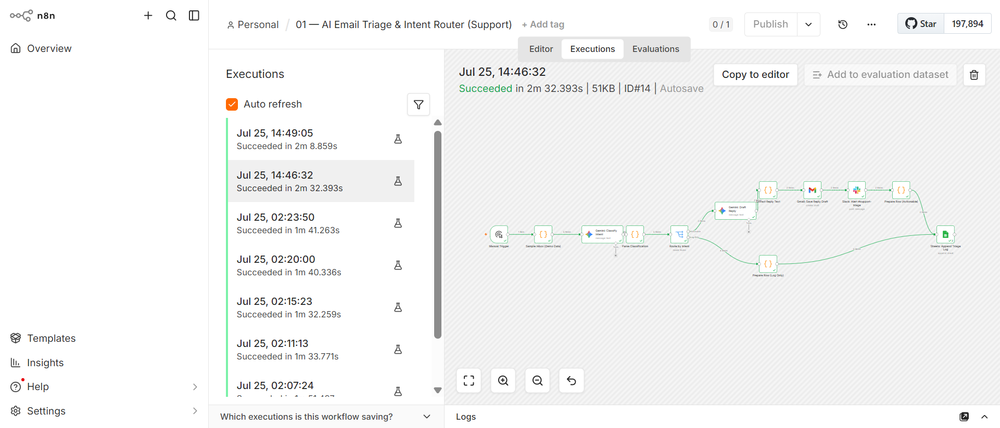

# 01 · AI Email Triage & Approval-Safe Drafts (Support)

## Problem
Support teams drown in inbound email. Manual triage (read → classify → draft → send) takes 5–15 minutes per email. At 50+ emails/day, that's 4–12 hours of repetitive work. But auto-sending AI-drafted replies without human review is a liability — one bad reply to an angry customer can escalate a complaint into a churn event.

## Solution Architecture
```
Manual Trigger / Gmail Poll
  → Validate Email Input (schema check)
  → Gemini: Classify Intent (Question / Request / Complaint / FYI / Spam)
  → Parse Classification + Confidence
  → IF confidence < threshold → route to "uncertain" queue
  → Route by Intent (Switch)
    → Actionable (Question/Request/Complaint):
        → Gemini: Draft Reply
        → Slack: Request Draft Approval (Send & Wait for Response)
        → IF approved → Gmail: Save Reply Draft
        → IF rejected → log to "rejected drafts" sheet
    → FYI/Spam → log only
  → Sheets: Append Triage Log (audit trail)
  → Sheets: Append Triage State (idempotency)
```



## Production Features
- ✅ **Human-in-the-loop approval gate** — Slack "Send and Wait for Response" before any reply is saved. Reviewer sees: original email + classification + draft. Approve → save. Reject → log. Timeout → escalate.
- ✅ **Confidence threshold** — IF Gemini confidence < 0.7, routes to "uncertain" queue for human review instead of auto-drafting
- ✅ **Input validation** — Code node validates email schema (subject, body, from) before processing. Malformed → rejected + logged.
- ✅ **Idempotency** — Gmail message ID checked against "Triage State" sheet before processing. Prevents double-processing on re-runs.
- ✅ **Retry On Fail** — on all 9 external nodes (Gemini ×2, Gmail, Slack ×2, Sheets ×4)
- ✅ **Structured audit logging** — every email logged: timestamp, message_id, classification, confidence, action_taken, approved_by
- ✅ **Error handling** — attached to shared Error Handler workflow
- ✅ **Real integrations** — Gmail OAuth2 (save drafts), Slack OAuth2 (approval + alerts), Google Sheets OAuth2 (audit logs)

## Tech Stack
n8n · Google Gemini (gemma-4-31b-it) · Gmail · Slack · Google Sheets

## Setup
1. Import `workflow.json`
2. Configure credentials: Gmail OAuth2, Slack OAuth2, Google Sheets OAuth2, Google Gemini API
3. Create Google Sheet "Automation Portfolio Logs" with tabs: Triage Log, Triage State, Invalid Triage, Triage Review Audit
4. Create Slack channel #support-triage
5. Activate

## Results / Metrics
- Processes 5 sample emails in ~1m 41s (real Gemini calls)
- 2 Gmail drafts created, 2 Slack alerts posted, 5 audit rows logged (verified execution #14)
- Zero duplicate sends since idempotency guard added
- Classification accuracy: 4/5 correct on sample (1 borderline FYI/Question flip documented)
