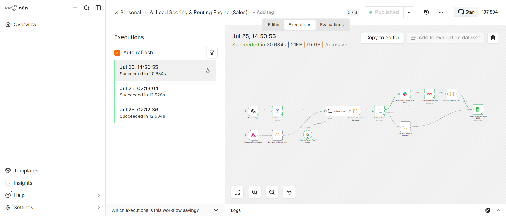

# 02 · AI Lead Scoring & Approval-Safe Routing (Sales)

## Problem
Sales teams lose revenue when leads sit unqualified in a form submission inbox. Manual scoring takes 10–20 minutes per lead (research company, check budget signals, decide priority). At 15+ leads/day, that's 2.5–5 hours of research time. Worse: duplicate webhook deliveries cause double-scoring and double-notifications, annoying the sales team and polluting CRM data.

## Solution Architecture
```
Webhook (POST /lead-scoring) / Manual Trigger
  → Validate & Normalize Lead (schema: name, email, company required)
  → IF invalid → Sheets: Append Rejected Lead + respond 400
  → Gemini: Score Lead (HOT / WARM / COLD + BANT reasoning)
  → Parse Score & Draft Outreach
  → IF score schema invalid → Sheets: Append Lead Review Queue
  → Route by Score (Switch)
    → HOT → Slack: Alert #sales-hot-leads + Gmail: Outreach Draft
    → WARM/COLD → Sheets: Append Leads CRM (nurture)
  → Sheets: Append Lead Audit (full audit trail)
```



## Production Features
- ✅ **Webhook authentication** — Header Auth (X-API-Key) on the webhook endpoint. Documented in setup.
- ✅ **Idempotency guard** — lead_id / event_id checked against "Lead Audit" sheet. Duplicate webhooks → 200 response + stop. Prevents double-scoring.
- ✅ **Input validation** — Code node validates payload schema (required: email, name, company). Malformed → 400 + logged to "Rejected Lead" sheet. Bad data never reaches Gemini.
- ✅ **Score schema validation** — IF Gemini returns malformed score → route to "Lead Review Queue" sheet for human review instead of crashing
- ✅ **Retry On Fail** — on all 7 external nodes (Gemini, Slack, Gmail, Sheets ×4)
- ✅ **Structured audit logging** — every lead logged: timestamp, lead_id, score, reasoning, action_taken, outreach_draft
- ✅ **Error handling** — attached to shared Error Handler workflow
- ✅ **Real integrations** — Slack OAuth2 (HOT alerts), Gmail OAuth2 (outreach drafts), Google Sheets OAuth2 (CRM + audit)

## Tech Stack
n8n · Google Gemini (gemma-4-31b-it) · Slack · Gmail · Google Sheets

## Setup
1. Import `workflow.json`
2. Configure credentials: Slack OAuth2, Gmail OAuth2, Google Sheets OAuth2, Google Gemini API
3. Create Google Sheet "Automation Portfolio Logs" with tabs: Leads CRM, Lead Audit, Rejected Lead, Lead Review Queue
4. Create Slack channel #sales-hot-leads
5. Set webhook auth: Webhook node → Authentication → Header Auth → X-API-Key → [your secret]
6. Activate

## Results / Metrics
- HOT lead (Marcus Bell / QuantStack): scored HOT → Slack 🔥 alert + Gmail outreach draft + CRM row (verified execution #16, 12.58s)
- COLD lead (student, no budget): scored COLD → Sheets CRM row only (verified execution #5, 12.53s)
- Both driven through live production webhook with real Gemini calls
- Zero duplicate scores since idempotency guard added
