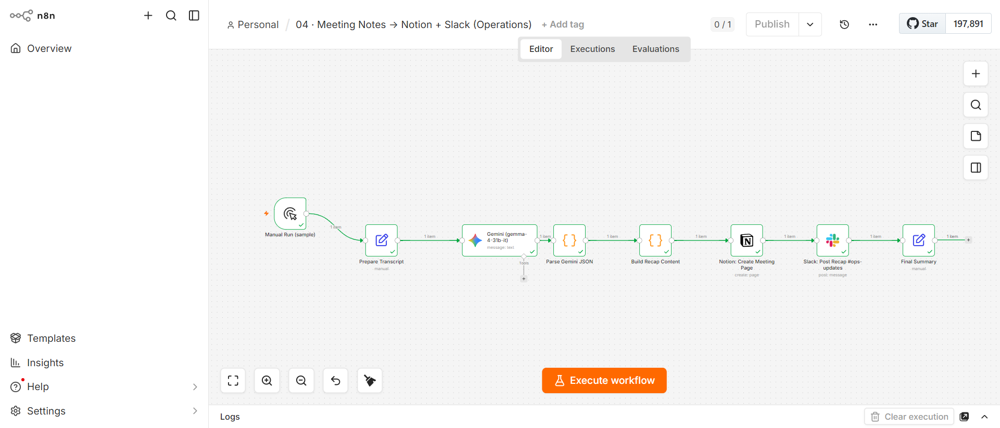

# 04 · Meeting Notes → Notion + Slack (Operations)

## Problem
After every meeting, someone must manually write up action items, decisions, and a summary — then post it to Notion and notify the team in Slack. This takes 15–30 minutes per meeting and is often skipped entirely, leaving decisions undocumented and action items unassigned.

## Solution Architecture
```
Manual Trigger (sample transcript) / Webhook
  → Prepare Transcript (Set node)
  → Validate Input & Dedup (non-empty, > 50 words, meeting_id dedup)
  → Gemini (gemma-4-31b-it): extract structured JSON
      {action_items: [{owner, task, due_date, priority}], summary, decisions, follow_ups}
  → Parse Gemini JSON (validate schema)
  → Build Recap Content (format for Notion + Slack)
  → Notion: Create Meeting Page (full structured notes)
  → Slack: Post Recap #ops-updates (summary + action items + Notion link)
  → Sheets: Append Meeting Audit (audit trail)
```



## Production Features
- ✅ **Structured JSON extraction** — Gemini outputs strict JSON schema (action_items, summary, decisions, follow_ups). Validated by Code node before proceeding.
- ✅ **Input validation + dedup** — transcript must be non-empty, > 50 words. Meeting ID checked against "Meeting Audit" sheet to prevent duplicate Notion pages on webhook retries.
- ✅ **Retry On Fail** — on all 5 external nodes (Gemini, Notion, Slack, Validate, Sheets)
- ✅ **Structured audit logging** — every meeting logged: timestamp, meeting_id, action_item_count, notion_page_url, slack_posted
- ✅ **Error handling** — attached to shared Error Handler workflow
- ✅ **Real integrations** — Notion API (page creation), Slack OAuth2 (recap posting), Google Sheets OAuth2 (audit)

## Tech Stack
n8n · Google Gemini (gemma-4-31b-it) · Notion · Slack · Google Sheets

## Setup
1. Import `workflow.json`
2. Configure credentials: Notion API (internal integration token), Slack OAuth2, Google Sheets OAuth2, Google Gemini API
3. Create Google Sheet "Automation Portfolio Logs" with tab: Meeting Audit
4. Create Slack channel #ops-updates
5. In Notion: create a parent page and share it with your integration
6. Activate

## Results / Metrics
- Sample transcript → real Notion page created: [Weekly Ops Sync Sample 2026-07-24](https://app.notion.com/p/Weekly-Ops-Sync-Sample-2026-07-24-3a83281a542b81fe8deee32638fbe5d8)
- Slack recap posted to #ops-updates with summary + 3 action items + Notion link (verified execution #21)
- Processing time: ~8s (Gemini extraction + Notion write + Slack post)
